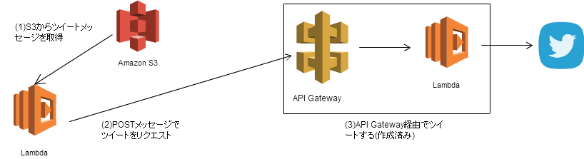

# jaws2016-lambda-hands-on

# イベント

+ [JAWS DAYS 2016](http://jawsdays2016.jaws-ug.jp/)
+ [(仮)Lambdaを使ってJawsDaysをHackしてみよう!](http://jawsdays2016.jaws-ug.jp/speaker/252)
+ 2016 3/12
+ 13:00-13:50(50min)

# 前提

+ 初心者向け
+ AWS アカウントは作成済み
+ AWS CLIは使わない（AWSマネージメントコンソール）
+ Lambdaのコードを書くのもマネージメントコンソールで行う
+ Node.js自体の細かい説明は省略

# ハンズオン概要

+ 予めAPI Gateway+Lambdaでツイートできるものを講師側で作成しておく。このAPIにPOSTリクエストを行うとメッセージ+ハッシュタグを付けてツイートする
+ ハンズオンではLambdaからAPI Gateawayにリクエストを行ってツイートさせる
+ ツイートさせるメッセージはS3から取得し、ランダムで一つのものをピックアップしてツイートさせる

# ページ構成

+ 表紙
+ 自己紹介
+ やることの説明
+ 概要図
+ 簡単なLambdaの説明
+ S3バケットの作成
+ バケット配下にツイート用のテキストメッセージを配置する
+ Lambdaに設定するS3へアクセスするためのRoleの作成
+ Lambda Functionの作成（最初はS3連携せず）
+ Lambda Functionの更新(S3と連携)
+ Lambdaでのスケジュール実行との組み合わせ（オプション）

# ソースコード

+ index.js->参加者が作成するコードのサンプル
+ backend/index.js->予め講師側で作成するAPI Gateway経由で実行するLambda Function
